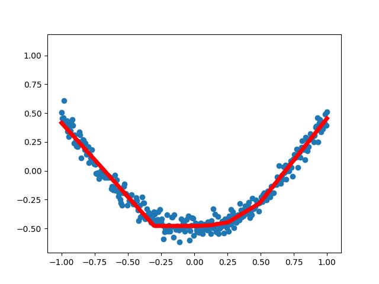

### Tensorflow Practice

1. P01 - simplest neural network. 
- Structure: Input layer - output layer.
- Ideal function: y = 0.3x + 0.1 
- Loss function: (y - y_label)^2. 
- Optimizer: Gradient Descent. 
- output:

    |rounds|weight|bias|
    |------|------|----|
    |0| [-0.48678386]| [0.7051269]|
    |20| [0.0845153]| [0.21306801]|
    |40| [0.24637519]| [0.12813774]|
    |60| [0.2866551]| [0.10700227]|
    |80| [0.29667902]| [0.10174257]|
    |100| [0.29917353]| [0.10043366]|
    |120| [0.29979432]| [0.10010793]|
    |140| [0.29994884]| [0.10002685]|
    |160| [0.2999873]| [0.10000668]|
    |180| [0.29999685]| [0.10000166]|
    
2. P02 - Session & Variable
- A tf.Variable is actually a Tensor, so as linear operations like tf.add().
- To assign a tensor to another tensor, use tf.assign()
- You must use Session().run() to fetch a tensor. 

3. P03 - Placeholder
- Use placeholder instead of Variable.
- Don't need to init.
- Use `feed_dict` to pass arguments.

4. P04 - A simple neural network
- Structure: 1 * 10(relu) * 1
- Loss_function: mean(sigma(square(y_predict - y_data)))
- Optimizer: gradient descent

    
    
5. P05 - Tensorborad

    
    
6. P06 - Classification on MNIST
- Structure: 728 * 10(softmax)
- Loss: cross entropy
- Optimizer: gradient_descent
- Test output: 2

    ![fig_P06_\[2\]](fig/fig_P06.png) 